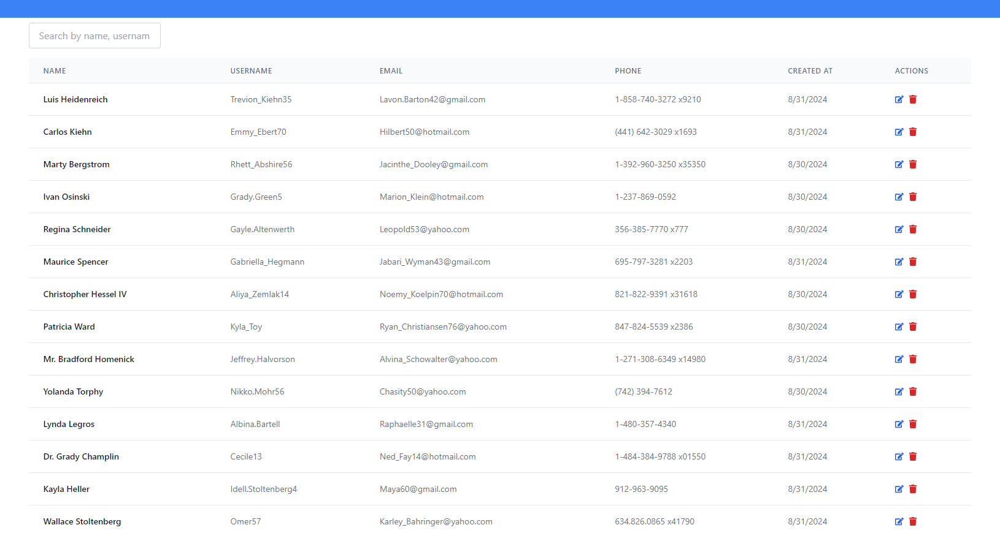
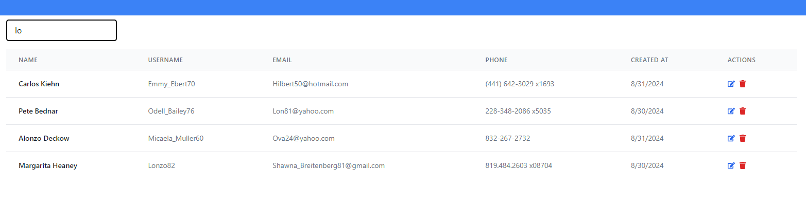

## About program
This program is a test assignment. This program is an ordinary table with filtering by fields.

## What is used
The technologies used are React and React-Router-Dom. The main programming language is TypeScript. 

## App 

  Unfiltered
  

  Filtered
  

## Stay in touch

- Author - [Nikita Endeka](https://www.linkedin.com/in/mykyta-endeka-66189625a/)